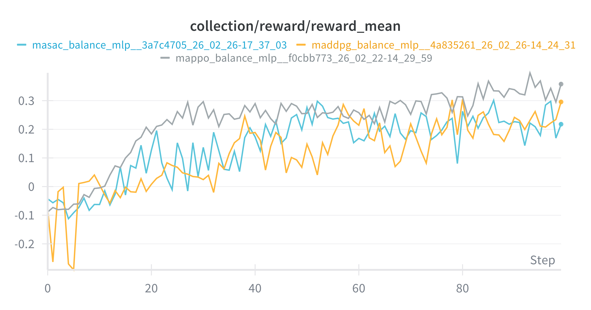
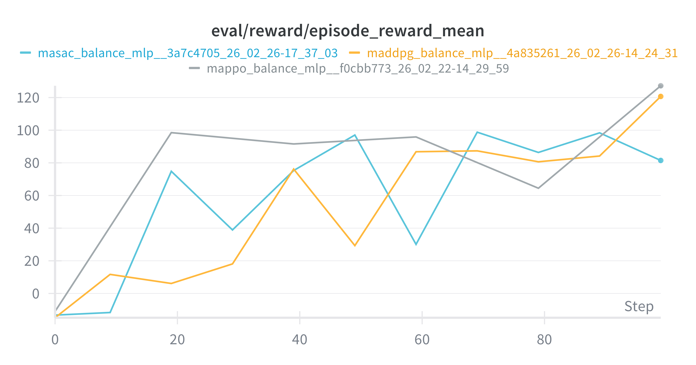

# Systematic Benchmarking of Cooperative MARL in VMAS Using BenchMARL

This repository contains a BenchMARL-based project for benchmarking cooperative Multi-Agent Reinforcement Learning (MARL) algorithms in continuous-control VMAS environments.

The work is summarized in the project report:

[Systematic_Benchmarking_of_Cooperative_Multi-Agent_Reinforcement_Learning_Algorithms_in_VMAS_Using_BenchMARL.pdf](metadata/Systematic_Benchmarking_of_Cooperative_Multi-Agent_Reinforcement_Learning_Algorithms_in_VMAS_Using_BenchMARL.pdf)

Authors: Andrea Stevanoska, Viktor Kostadinoski, Gorazd Filipovski, Sonja Gievska, and Martina Toshevka.

## Overview

The project studies how different cooperative MARL algorithms behave across several VMAS tasks with different coordination requirements. The goal is not to introduce a new algorithm, but to compare existing BenchMARL algorithms under a structured and reproducible workflow.

BenchMARL is used because it separates the main parts of an experiment into modular configuration layers:

- **Algorithm configuration**: selects and configures the learning method.
- **Model configuration**: selects the neural network architecture used by the agents.
- **Experiment configuration**: controls global training settings such as learning rate, batch sizes, evaluation intervals, replay buffers, and checkpointing.
- **Task configuration**: controls the VMAS scenario, reward shaping, physical properties, episode length, and observations.

VMAS is used as the simulator because it provides vectorized continuous-control multi-agent tasks with coupled dynamics, shared objectives, and rich cooperative behavior.

## Evaluated Tasks

The report focuses on cooperative VMAS tasks that require different forms of coordination:

| Task | Coordination challenge |
| --- | --- |
| `reverse_transport` | Agents must move a heavy shared package to a target through synchronized force application. |
| `joint_passage_size` | Connected agents must pass through constrained gates while avoiding blockage and poor alignment. |
| `multi_give_way` | Multiple agents must negotiate right-of-way in a narrow corridor. |
| `give_way` | A simpler two-agent version of the right-of-way negotiation task. |
| `balance` | Agents must stabilize and move a shared object while balancing orientation and progress. |

## Evaluated Algorithms

The study evaluates representative cooperative MARL algorithms available in BenchMARL:

- `MAPPO`
- `MADDPG`
- `MASAC`
- `QMIX`
- `VDN`

The experiments mainly use MLP policies and critics as a consistent baseline architecture. Other model families are available in BenchMARL, but initial exploratory runs did not produce enough improvement to make model architecture the main focus of the study.

## Main Findings

The key result is that algorithm performance is strongly task-dependent.

- **MAPPO** produced the most stable learning in constrained coordination tasks such as `joint_passage_size` and `balance`.
- **MADDPG** performed well in right-of-way negotiation tasks after task-level tuning, especially in `give_way` and `multi_give_way`.
- **MASAC** often produced numerically stable training but less reliable final coordination behavior.
- **QMIX** and **VDN** performed weakly on the selected continuous-control VMAS tasks, which is consistent with their stronger fit for discrete or more additive value-decomposition settings.
- Task configuration and reward shaping often mattered as much as algorithm hyperparameters. In several tasks, longer training alone did not solve coordination failures.

One important conclusion from the report is that reward curves are not enough by themselves. Quantitative learning curves should be combined with qualitative behavior inspection, because agents can reach locally stable but incomplete strategies.

## Example Result Artifacts

Some generated plots and evaluation snapshots are stored under `metadata/`.





Additional artifacts:

- `metadata/Andrea/`: task-level result images for balance, give way, multi give way, and reverse transport.
- `metadata/Viktor/`: baseline, parallel, and parking reward/loss plots.
- `metadata/Systematic_Benchmarking_of_Cooperative_Multi-Agent_Reinforcement_Learning_Algorithms_in_VMAS_Using_BenchMARL.pdf`: full written report.

## Repository Structure

```text
benchmarl/                  BenchMARL source code and configuration files
benchmarl/conf/algorithm/   Algorithm YAML configurations
benchmarl/conf/experiment/  Global experiment configuration
benchmarl/conf/model/       Model configuration files
benchmarl/conf/task/vmas/   VMAS task configuration files
src/experiments/            Project notebooks and training scripts
src/lab_example/            Student lab notebook and supporting material
metadata/                   Report, plots, and result images
notebooks/run.ipynb         Official BenchMARL Colab-style run notebook
```

Useful entry points:

- [src/experiments/notebooks/main_training_script.py](src/experiments/notebooks/main_training_script.py)
- [src/experiments/notebooks/main_andrea.ipynb](src/experiments/notebooks/main_andrea.ipynb)
- [src/experiments/notebooks/main_viktor.ipynb](src/experiments/notebooks/main_viktor.ipynb)
- [src/lab_example/benchmarl_vmas_lab_exercise.ipynb](src/lab_example/benchmarl_vmas_lab_exercise.ipynb)

## Installation

Create and activate a Python environment, then install the project in editable mode.

```bash
python -m pip install -U pip
python -m pip install -U torch torchvision
python -m pip install -e .
python -m pip install vmas
```

For experiment tracking and video/logging support, install the logging extras:

```bash
python -m pip install -e ".[logging]"
```

BenchMARL also supports installing VMAS through the package extra:

```bash
python -m pip install -e ".[vmas]"
```

## Running Experiments

You can run BenchMARL experiments from the command line with Hydra overrides.

Small smoke test:

```bash
python benchmarl/run.py algorithm=mappo task=vmas/balance experiment.max_n_frames=12000 "experiment.loggers=[]"
```

Multi-run comparison:

```bash
python benchmarl/run.py -m algorithm=mappo,maddpg,masac task=vmas/balance,vmas/reverse_transport seed=0,1 experiment.max_n_frames=12000 "experiment.loggers=[]"
```

You can also run or adapt the project scripts:

```bash
python src/experiments/notebooks/main_training_script.py
```

The script-based workflow follows the same BenchMARL structure:

```python
from benchmarl.algorithms import MappoConfig
from benchmarl.environments import VmasTask
from benchmarl.experiment import Experiment, ExperimentConfig
from benchmarl.models import MlpConfig

exp_config = ExperimentConfig.get_from_yaml()
task = VmasTask.BALANCE.get_from_yaml()
algorithm = MappoConfig.get_from_yaml()
model = MlpConfig.get_from_yaml()

experiment = Experiment(
    task=task,
    algorithm_config=algorithm,
    model_config=model,
    critic_model_config=model,
    seed=0,
    config=exp_config,
)
experiment.run()
```

## Configuration Notes

The most important configuration files are:

- [benchmarl/conf/experiment/base_experiment.yaml](benchmarl/conf/experiment/base_experiment.yaml)
- [benchmarl/conf/algorithm](benchmarl/conf/algorithm)
- [benchmarl/conf/model](benchmarl/conf/model)
- [benchmarl/conf/task/vmas](benchmarl/conf/task/vmas)

Experiment-level parameters control training duration, frames per batch, number of parallel environments, evaluation interval, replay buffer settings, checkpointing, logging, and devices.

Task-level parameters are often critical. The report repeatedly finds that changing only algorithm hyperparameters is not always enough. For example, reward shaping, package mass, maximum episode steps, relative observations, and completion-based termination can change whether agents learn meaningful cooperation.

Example task-level override in a script:

```python
task = VmasTask.REVERSE_TRANSPORT.get_from_yaml()
task.config["max_steps"] = 400
task.config["package_mass"] = 5
```

## Reproducibility Workflow

The report followed this general workflow:

1. Run controlled baselines with default BenchMARL task, algorithm, model, and experiment settings.
2. Compare algorithms using both training and evaluation reward curves.
3. Inspect qualitative behavior, not only scalar reward.
4. Deprioritize algorithms with persistent instability or weak coordination.
5. Tune promising algorithms through learning rates, entropy/exploration settings, target updates, episode horizons, reward shaping, and task physics.
6. Track experiments with Weights & Biases and store plots/checkpoints for comparison.

## Future Work

The report identifies several directions for further work:

- More extensive MASAC tuning, especially entropy and longer training schedules.
- Systematic model architecture exploration beyond MLPs, including recurrent models.
- Scalability tests with more agents and harder task variants.
- Communication mechanisms or hybrid approaches for more complex coordination.
- More careful separation between reward-curve improvements and actual task completion behavior.

## References

This project is based on:

- Matteo Bettini, Ryan Kortvelesy, Jan Blumenkamp, and Amanda Prorok. VMAS: A Vectorized Multi-Agent Simulator for Collective Robot Learning. 2022.
- Matteo Bettini, Amanda Prorok, and Vincent Moens. BenchMARL: Benchmarking Multi-Agent Reinforcement Learning. Journal of Machine Learning Research, 2024.

See the full report in [metadata/](metadata/) for the complete discussion and bibliography.
